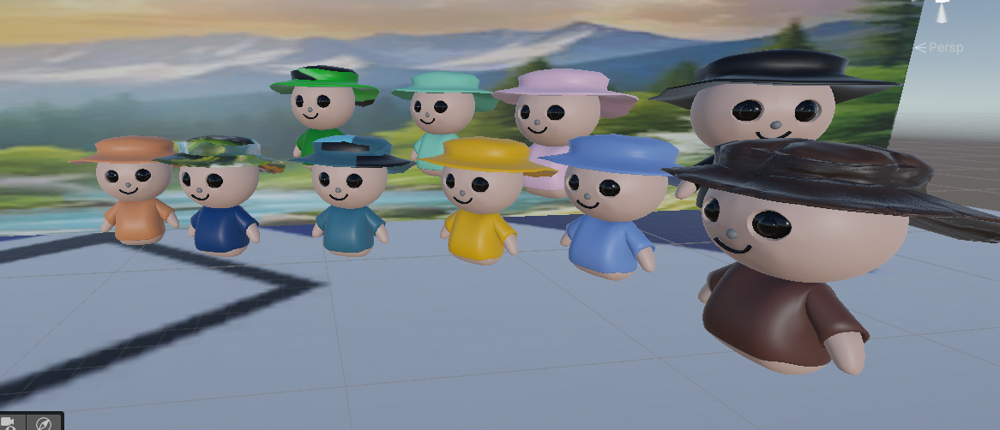

# Blender-Assets

## Blender Models Collection

This repository contains 3D models created in Blender.
All models are organized, optimized, and exported for easy use in Blender and other 3D software.

🖼️ Screenshots

Here are some previews of the models:

